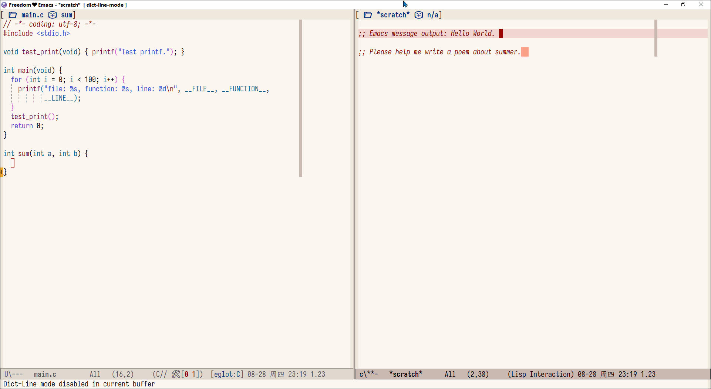

WARING: `gptel-watch.el` Most of the code is written by AI.

`gptel-watch` Inspired by `aider --watch-files`

# gptel-watch

`gptel-watch` is an Emacs minor mode that automatically invokes `gptel-request` when the user types certain lines that indicate intent — for example, lines ending with `"AI!"` or `"#ai"`. It uses GPT-style large language models to assist writing or coding directly within your buffer, based on local context.

This package builds on [`gptel`](https://github.com/karthink/gptel), providing a lightweight, pattern-driven workflow for triggering GPT responses while typing.

---

## Preview


## ✨ Features

- Monitors user input and triggers GPT when a line ends with defined patterns.
- Automatically extracts ±10 lines of context around the trigger line.
- Clears the trigger line and replaces it with GPT-generated output.
- Works seamlessly with `newline`, `org-return`, or any custom command you define.
- Supports global and per-buffer activation.

---

## 📦 Installation

```elisp
(use-package gptel-watch
  :after gptel
  :load-path "/path/gptel-watch/"
  :config
  (gptel-watch-global-mode 1))  ;; Optional: enable globally
```

## 🚀 Usage
Once enabled, write a line like this:
```C
// Print Hello World. AI!
```
Then press `RET`. The line will be replaced with the GPT-generated result, such as:
```C
printf("Hello World");
```
The request is built from ±10 lines of context surrounding the trigger line and sent to your configured GPT model using `gptel-request`.

## 🔧 Customization

| Variable                       | Description                                                                                              |
| ------------------------------ | -------------------------------------------------------------------------------------------------------- |
| `gptel-watch-trigger-patterns` | List of regex patterns. If a line ends with any of these, it triggers GPT. Default: `("AI" "AI!" "#ai")` |
| `gptel-watch-trigger-commands` | List of Emacs commands that can trigger checking. Default: `(newline org-return)`                        |
| `gptel-watch-system-prompt`    | The system prompt sent to GPT along with the context. Guides the style and constraints of the reply.     |

All customization can also be set via `setq` in your `init.el`

## 🧠 Example Workflow
1. Write your idea or prompt inline with a marker like // AI! or #ai.

2. Press RET.

3. GPT fills in the next logical content based on surrounding context.

4. Continue writing!

## 🔍 Advanced Notes
This package uses `post-command-hook` to monitor input commands.

- Only non-minibuffer buffers are affected.

- Trigger pattern matching is based on line suffixes — regexes are appended with $ internally.

- The system prompt is critical for shaping the LLM output — tune it to suit your use case (e.g., short replies, no Markdown, coding only, etc.).

## ✅ Provided Modes
| Mode                      | Scope        | Description                            |
| ------------------------- | ------------ | -------------------------------------- |
| `gptel-watch-mode`        | Buffer-local | Enable GPT triggers in current buffer  |
| `gptel-watch-global-mode` | Global       | Enable GPT triggers across all buffers |
